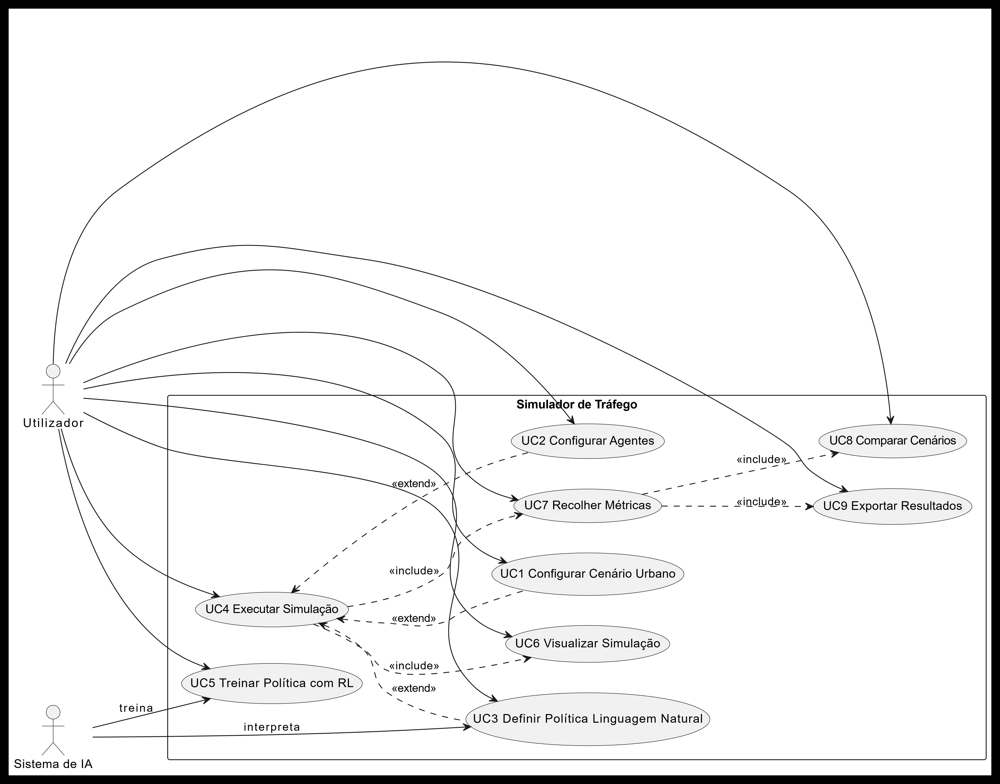

# Plano de Trabalho do Projeto UrbanFlow AI

## 1. Introdução e Contexto

Título: **Gestão Inteligente de Tráfego Urbano com Simulação de Agentes**

### Contexto e Motivação

O tráfego urbano representa um desafio crescente nas cidades modernas, com impactos significativos na qualidade de vida, economia e ambiente. Sistemas de controlo semafórico tradicionais baseiam-se em temporizações fixas, que não se adaptam às variações dinâmicas do fluxo de veículos, levando a congestionamentos desnecessários, aumento de emissões de CO2 e tempos de espera prolongados. A integração de Inteligência Artificial (IA) e simulação baseada em agentes oferece uma oportunidade para otimizar estes sistemas, permitindo decisões mais inteligentes e adaptativas.

Este projeto insere-se no contexto da unidade curricular de Laboratório de Projeto em Engenharia Informática, visando o desenvolvimento de uma solução inovadora que combina simulação multiagente, processamento de linguagem natural e aprendizagem por reforço para gestão de tráfego urbano.

### Objetivo Global do Protocolo

O objetivo principal é desenvolver um simulador de tráfego urbano inteligente que permita:

- Simular tráfego urbano multiagente (veículos, semáforos, peões);
- Permitir controlo por regras em linguagem natural;
- Comparar controlo tradicional vs. controlo inteligente;
- Medir desempenho (espera, fluxo, emissões, emergência);
- Disponibilizar interface gráfica de monitorização e análise.

### Âmbito e Delimitações

O projeto foca-se na simulação de interseções semafóricas em grelhas urbanas parametrizáveis, com ênfase em algoritmos de IA para otimização. Não inclui simulação de tráfego em vias principais ou integração com sistemas reais de tráfego urbano. A validação é realizada através de experimentos controlados e análise estatística.

### Metodologia

Adota-se uma abordagem ágil com desenvolvimento iterativo, utilizando ferramentas de IA para geração de código e documentação. O projeto segue princípios de "Vibe Coding", onde instruções em linguagem natural são traduzidas em código executável.

---

## 2. Casos de Uso

*O diagrama abaixo representa um dos casos de uso principais do sistema (configuração/execution/comparison).*

Utilizador a intergair com o simulador em todos os passos importantes((configurar cenário, agentes, executar, recolher métricas, comparar, exportar), e a seta para o **Sistema de IA** indica a parte de treino/interpretar regras.

### UC1: Simulação de Cenário de Tráfego

- **Ator Principal**: Engenheiro de Tráfego / Investigador
- **Descrição**: O utilizador configura a simulação com parâmetros específicos (dimensão da grelha, cenário, modo de controlo), inicia a simulação e observa o comportamento do tráfego em tempo real.
- **Pré-condições**: Sistema inicializado, interface carregada.
- **Pós-condições**: Métricas coletadas, visualização atualizada.
- **Fluxo Principal**:
  1. Selecionar dimensão da grelha (ex: 4x4).
  2. Escolher cenário (normal, hora de ponta, acidente, emergência).
  3. Definir modo (IA ou tradicional).
  4. Iniciar simulação.
  5. Observar visualização e métricas.

### UC2: Introdução e Aplicação de Regras em Linguagem Natural

- **Ator Principal**: Administrador de Sistema
- **Descrição**: O utilizador define regras de controlo de tráfego em português natural, que são traduzidas para lógica executável e aplicadas na simulação.
- **Pré-condições**: Backend API ativo.
- **Pós-condições**: Regra ativa na simulação.
- **Fluxo Principal**:
  1. Introduzir regra em texto (ex: "Dar prioridade a ambulâncias").
  2. Enviar para tradução via API.
  3. Verificar tradução e confirmar aplicação.
  4. Observar efeito na simulação.

### UC3: Comparação Estatística de Modos de Controlo

- **Ator Principal**: Investigador / Analista
- **Descrição**: O utilizador executa campanhas experimentais para comparar desempenho de IA vs tradicional, gera análises estatísticas e relatórios.
- **Pré-condições**: Scripts de experimentos configurados.
- **Pós-condições**: Relatórios gerados em CSV/JSON/Markdown.
- **Fluxo Principal**:
  1. Configurar campanha (cenários, repetições, modos).
  2. Executar experimentos.
  3. Agregar dados.
  4. Gerar análise estatística e gráficos.

### UC4: Treino e Avaliação de Agente de Aprendizagem por Reforço

- **Ator Principal**: Cientista de Dados
- **Descrição**: O utilizador treina um agente RL para otimizar controlo de semáforos e avalia o desempenho comparativamente.
- **Pré-condições**: Ambiente de treino configurado.
- **Pós-condições**: Política treinada, métricas de avaliação.
- **Fluxo Principal**:
  1. Configurar parâmetros de RL (alpha, gamma, epsilon).
  2. Executar treino.
  3. Avaliar contra modos tradicionais.
  4. Persistir política e histórico.

### UC5: Monitorização e Análise de Métricas em Tempo Real

- **Ator Principal**: Operador de Tráfego
- **Descrição**: O utilizador monitoriza métricas globais e por classe durante a simulação para tomada de decisões.
- **Pré-condições**: Simulação em execução.
- **Pós-condições**: Dados exportados se necessário.
- **Fluxo Principal**:
  1. Iniciar simulação.
  2. Visualizar métricas (espera, fluxo, emissões).
  3. Exportar snapshots para análise posterior.

---

## 3. Estado Atual

### 3.1 Núcleo de Simulação (Frontend)

Estado: **Implementado**

Foi implementado um motor de simulação (`SimulationEngine`) em JavaScript, utilizando um loop de atualização baseado em `requestAnimationFrame` para garantir suavidade e eficiência. O motor inclui:

- **Grelha Parametrizável**: Suporte para grelhas de 2x2 a 10x10 interseções, cada uma com semáforos independentes nas direções Norte-Sul (NS) e Este-Oeste (EW).
- **Fases Semafóricas**: Ciclos de luzes (vermelho → verde → amarelo → vermelho) com durações configuráveis, sincronizadas entre direções opostas.
- **Modos de Controlo**:
  - `traditional`: Temporizações fixas baseadas em heurísticas simples.
  - `ai`: Controlo adaptativo baseado em regras definidas pelo utilizador ou algoritmos de IA.
- **Cenários Dinâmicos**:
  - Normal: Fluxo padrão de veículos.
  - Hora de Ponta: Aumento da densidade de tráfego.
  - Acidente: Bloqueio de vias em interseções específicas.
  - Emergência: Introdução de veículos prioritários (ambulâncias) com regras especiais.
- **Geração de Veículos**: Sistema probabilístico para spawn de veículos em bordas da grelha, com classes distintas:
  - Ligeiros (`car`): Maioria do tráfego.
  - Pesados (`bus`): Movimentação mais lenta, impacto maior no fluxo.
  - Emergência (`ambulance`): Prioridade máxima, ignoram semáforos vermelhos em situações críticas.
- **Regras de Prioridade**: Lógica para dar passagem a emergências, ajustando fases semafóricas dinamicamente.
- **Métricas em Tempo Real**:
  - Globais: Tempo total de simulação, veículos concluídos, emissões estimadas.
  - Por Classe: Tempos de espera médios, fluxo por tipo de veículo.
  - Comparativa: Diferenças percentuais entre modos IA e tradicional.
- **Otimização de Performance**: Uso de estruturas de dados eficientes para rastreamento de veículos e interseções, evitando cálculos desnecessários em loops aninhados.

### 3.2 Visualização da Simulação (Canvas)

Estado: **Implementado**

A visualização é implementada utilizando a API Canvas do HTML5, com renderização em tempo real a 60 FPS para uma experiência fluida. O sistema inclui:

- **Rede Viária**: Desenho de ruas e interseções com linhas sólidas e tracejadas, representando vias de sentido único e bidirecionais.
- **Semáforos Dinâmicos**: Ícones coloridos (vermelho, amarelo, verde) que mudam conforme as fases, com indicadores de direção (setas para NS/EW).
- **Veículos em Movimento**: Sprites simples para diferentes classes de veículos, com animação suave baseada em posições calculadas. Estados visuais para parado (vermelho) vs. em movimento (verde).
- **Indicação de Bloqueios/Acidentes**: Overlays visuais em interseções afetadas, com ícones de aviso e redução de opacidade para vias bloqueadas.
- **HUD Informativo**: Painel superior com informações em tempo real: tempo decorrido, modo atual (IA/Tradicional), velocidade de simulação (0.5x a 4x), e estatísticas básicas.
- **Responsividade**: Ajuste automático do canvas ao tamanho da janela, mantendo proporções da grelha.
- **Performance**: Uso de técnicas como double buffering e atualização seletiva de regiões para minimizar redraws desnecessários.

### 3.3 Interface de Controlo

Estado: **Implementado**

A interface de controlo é construída com React, utilizando componentes modulares para uma experiência de utilizador intuitiva. Inclui:

- **Controles Básicos**: Botões para iniciar/pausar/reset a simulação, com estados visuais claros (play/pause/reset).
- **Configuração de Cenário**: Dropdown para seleção de cenários (normal, hora de ponta, acidente, emergência), aplicando mudanças imediatas na simulação.
- **Seleção de Modo**: Toggle entre IA e tradicional, com feedback visual no HUD.
- **Ajuste de Velocidade**: Slider para controlar a velocidade da simulação (0.5x a 4x), afetando o timestep do motor.
- **Dimensão da Grelha**: Controlo numérico para alterar o tamanho da grelha em tempo real, reiniciando a simulação automaticamente.
- **Gestão de Regras**:
  - Campo de texto para introduzir regras em português (ex.: "Dar prioridade a ambulâncias").
  - Lista de regras ativas com opções para visualizar, editar ou remover.
  - Tradução automática via API backend, com validação de sintaxe.
- **Visualização de Métricas**: Painéis expansíveis mostrando métricas globais e por classe, com gráficos simples (barras para comparações IA vs tradicional).
- **Feedback de Utilizador**: Mensagens de erro/sucesso para ações inválidas, tooltips explicativos.

### 3.4 Backend API

Estado: **Implementado (núcleo)**

O backend é desenvolvido com FastAPI em Python, proporcionando uma API RESTful robusta e assíncrona. Inclui:

- **Tradução de Regras**: Endpoint `POST /api/rules/translate` que recebe texto em linguagem natural e retorna um JSON estruturado com condições e ações executáveis. Utiliza parsing simples baseado em keywords para mapear frases em lógica booleana.
- **Persistência de Métricas**: Endpoint `POST /api/metrics/save` para armazenar snapshots de métricas em MongoDB, incluindo timestamps, configurações de simulação e dados agregados.
- **Exportação de Dados**: Endpoint `POST /api/metrics/export` para gerar arquivos CSV a partir de snapshots armazenados, facilitando análise externa.
- **Infraestrutura de Suporte**: Integração com MongoDB para armazenamento NoSQL, CORS para comunicação com frontend, e validação de dados com Pydantic.
- **Extensibilidade**: Estrutura modular permite adição fácil de novos endpoints para campanhas experimentais ou integração com módulos de IA.

Além disso, mantém-se a infraestrutura FastAPI + MongoDB + CORS.

---

## 4. Pendências e Validação Científica

### 4.1 Validação Experimental Formal

Estado: **Implementado (pipeline robusto e emparelhado)**

Foi implementado um pipeline completo de validação experimental, assegurando reprodutibilidade e rigor científico:

- **Runner Automático**: Script `run-experiments.cjs` em Node.js que orquestra campanhas, executando simulações em lote com parâmetros variados. Suporta configuração de número de repetições, cenários e modos de controlo.
- **Controlo de Reproducibilidade**: Uso de sementes pseudoaleatórias fixas para geração de veículos e eventos, garantindo que execuções idênticas produzam os mesmos resultados.
- **Execução Paralela**: Possibilidade de correr múltiplas simulações em paralelo (limitado pelo frontend), com logging detalhado de progresso.
- **Exportação de Dados**: Geração automática de arquivos CSV e JSON com métricas agregadas, incluindo tempos de espera, fluxo de veículos e emissões estimadas.
- **Análise Estatística**: Script `analyze_campaign.py` em Python utilizando SciPy para:
  - Cálculo de médias e intervalos de confiança (CI95).
  - Testes de significância (teste de permutação para diferenças entre IA e tradicional).
  - Geração de gráficos comparativos com Matplotlib.
- **Desenho Emparelhado**: Metodologia avançada onde cada par IA-Tradicional é executado com as mesmas condições iniciais, reduzindo variabilidade e aumentando poder estatístico.
- **Relatórios Automatizados**: Produção de documentos Markdown com tabelas, gráficos e interpretações, prontos para inclusão no relatório académico.

### 4.2 Módulo de Aprendizagem (RL)

Estado: **Implementado (Q-Learning tabular)**

Foi desenvolvido um agente de aprendizagem por reforço baseado em Q-Learning, integrado no motor de simulação:

- **Definição de Estado**: Vetor multidimensional incluindo fase semafórica atual, discretização do comprimento das filas NS/EW (bins de 0-5, 6-10, >10 veículos), e flag de presença de emergência. Resulta em ~100 estados possíveis para uma interseção simples.
- **Espaço de Ações**: Durações do verde em segundos (5-30s), com ações discretas para simplificar o problema.
- **Função de Recompensa**: Combinação de redução de filas (recompensa positiva por veículos que passam), penalização por pressão de fila acumulada, e penalizações severas por colisões ou atrasos de emergência.
- **Algoritmo Q-Learning**: Implementação com parâmetros ajustáveis: taxa de aprendizagem (alpha=0.1), desconto (gamma=0.9), exploração epsilon-greedy (epsilon inicial=1.0, decaimento exponencial).
- **Persistência**: Salvamento da tabela Q em JSON, permitindo carregamento para avaliação ou continuação de treino.
- **Scripts de Treino e Avaliação**:
  - `train-rl-agent.cjs`: Executa episódios de treino em background, atualizando a política.
  - `evaluate-rl-agent.cjs`: Compara desempenho da política treinada contra baselines (tradicional e heurística IA).
- **Diagnóstico**: Logging de histórico de treino (recompensas por episódio, convergência), e métricas de avaliação (média de filas reduzidas, tempo de emergência).

### 4.3 Gestão de Dados de Experiência

Estado: **Implementado (núcleo de campanha)**

Foi estabelecido um sistema robusto de gestão de dados para suportar experimentação em larga escala:

- **Persistência de Snapshots**: Cada simulação gera snapshots temporizados com métricas detalhadas, armazenados em MongoDB com estrutura hierárquica (campanha > par > repetição > snapshot).
- **Estrutura de Campanha**: Metadados abrangentes incluindo ID único da campanha, pares de comparação (ex.: IA vs Tradicional), repetições por par, e configurações (seed, cenário, modo, duração, timestep, dimensão da grelha).
- **Agregação e Análise**: Scripts Python para processar dados crus em agregados estatísticos, com suporte a filtros por campanha ou cenário.
- **Geração de Figuras**: Integração com Matplotlib para criar gráficos comparativos (ex.: barras de tempos de espera, linhas de fluxo ao longo do tempo).
- **Histórico Centralizado**: Embora atualmente baseado em arquivos locais, a arquitetura permite futura migração para coleções MongoDB dedicadas, facilitando acesso remoto e versionamento.
- **Integridade de Dados**: Validação automática de consistência entre metadados e resultados, com logs de erros para debugging.

### 4.4 Documentação Científica

Estado: **Implementado e em consolidação final**

A documentação académica encontra-se produzida e foi reforçada com protocolo congelado, matriz de rastreabilidade e extensões metodológicas:

- **Metodologia**: Descrição detalhada da abordagem de desenvolvimento, incluindo "Vibe Coding", integração de IA, e ciclo ágil. Explicação do pipeline experimental e técnicas estatísticas empregues.
- **Formulação do Problema**: Contextualização do desafio de controlo de tráfego urbano, revisão de literatura sobre sistemas semafóricos inteligentes, e definição formal do problema de otimização.
- **Métricas e Hipóteses**: Especificação de KPIs (tempo de espera, fluxo, emissões), hipóteses testadas (ex.: IA reduz espera em >20% vs tradicional), e validação estatística.
- **Resultados Quantitativos**: Apresentação de dados experimentais com tabelas, gráficos e análise de significância. Comparações entre modos (tradicional, IA heurística, RL).
- **Discussão Crítica**: Interpretação dos resultados, limitações do modelo (ex.: simulação 2D simplificada), e implicações práticas para cidades reais.
- **Trabalho Futuro**: Sugestões de extensões, como integração com dados reais de tráfego, multi-interseção ou IA avançada (deep RL).
- **Estrutura do Relatório**: Seguindo normas académicas, com introdução, estado da arte, metodologia, resultados, discussão e conclusão.

---

## 5. Fecho e Comandos

Para concluir o projeto com qualidade académica elevada, recomenda-se a seguinte sequência de passos:

1. **Congelar Baseline Atual**: Criar uma tag Git para a versão estável atual, assegurando reprodutibilidade futura.
2. **Executar Campanha Completa**: Correr experimentos com n>=30 repetições por cenário, gerando `latest.csv` com dados abrangentes.
3. **Análise Estatística**: Executar scripts de análise para calcular médias, IC95 e testes de significância, validando diferenças entre modos.
4. **Produzir Gráficos Comparativos**: Gerar figuras a partir dos CSVs, incluindo barras para tempos de espera e linhas para fluxo temporal.
5. **Redigir Capítulo de Resultados e Discussão**: Compilar dados em secções do relatório, com interpretação crítica e limitações.
6. **(Opcional Forte) Integrar Agente RL**: Treinar e avaliar o módulo RL, comparando com heurística IA para demonstrar avanços.

### Comandos de Execução (Reproduzíveis)

**No Frontend** (para experimentos):

- `npm run experiment:quick`: Execução rápida de teste.
- `npm run experiment:run`: Campanha completa com parâmetros configuráveis.

**Na Análise (Backend)**:

- `python experiments/analyze_campaign.py`: Análise estatística dos resultados.
- `python experiments/run_full_pipeline.py --sync-frontend-figures`: Pipeline completo com geração de figuras.

**Saídas Esperadas**:

- `Frontend/experiments/results/latest.csv`: Dados crus da campanha.
- `Backend/experiments/results/summary_by_mode.csv`: Resumos agregados.
- `Backend/experiments/results/comparison_ai_vs_traditional.csv`: Comparações diretas.
- `Backend/experiments/results/analise_experimental.md`: Relatório Markdown com tabelas e gráficos.
- `Backend/experiments/results/comparison_ai_vs_traditional.csv`
- `Backend/experiments/results/analise_experimental.md`

---

## 6. Plano de Trabalho Detalhado

### 7.1 Introdução e Definição de Objetivos do Projeto

Contextualização:

Os sistemas de semaforização tradicionais usam temporizações fixas ou pouco adaptativas, o que pode gerar congestionamento desnecessário quando o fluxo de tráfego varia rapidamente. O projeto propõe um ambiente de simulação de tráfego urbano baseado em agentes (veículos, semáforos e, opcionalmente, peões), permitindo testar cenários complexos de forma controlada e repetível.

A abordagem de desenvolvimento integra "Vibe Coding": o utilizador define instruções comportamentais em linguagem natural de alto nível (ex.: "priorizar ambulâncias"), que são interpretadas e traduzidas em regras executáveis na simulação. Em paralelo, será explorada otimização automática através de Reinforcement Learning (RL) para aprender políticas de controlo semafórico que maximizem a fluidez e reduzam tempos de espera e emissões estimadas.

Objetivo Principal:

Desenvolver um simulador de tráfego urbano por agentes onde políticas de controlo semafórico possam ser definidas em linguagem natural, testadas e otimizadas por IA, com recolha de métricas e validação comparativa.

Objetivos Específicos:

Implementar o ambiente de simulação com regras físicas básicas (movimento, limites de velocidade, prevenção/deteção de colisões).

Implementar agentes (veículos, semáforos e, se incluído no âmbito, peões) com parâmetros configuráveis.

Implementar o módulo de interpretação/tradução de linguagem natural para regras executáveis (Vibe Coding).

Integrar um módulo de RL para otimização de políticas de semáforos e comparação com um baseline (controlo fixo/tradicional).

Desenvolver uma interface de visualização em tempo real e um sistema de recolha de métricas.

Validar o sistema em cenários críticos (hora de ponta, acidente, veículo prioritário) e comparar resultados.

### 7.2 Investigação e Estado da Arte

Revisão de Literatura:

Simulação de tráfego baseada em agentes: conceitos, vantagens e limitações.

Controlo semafórico adaptativo: abordagens clássicas vs. IA.

RL aplicado a tráfego: estados, ações, recompensas e estabilidade de treino.

Estimativa de emissões/impacto ambiental em simulação (métricas e modelos simplificados).

Análise de Soluções Existentes:

Identificar 2–4 soluções/ferramentas (simuladores, bibliotecas ou sistemas de controlo) e apontar:

O que fazem bem (ex.: simulação realista, visualização, exportação de dados).

O que não resolvem no teu caso (ex.: falta de "linguagem natural → regras", falta de RL integrado, dificuldade de personalizar comportamentos).

Seleção Tecnológica:

Simulação: (indicar framework/linguagem).

IA/RL: (indicar biblioteca) e porquê (comunidade, exemplos, facilidade de treino).

Linguagem natural: abordagem (parser estruturado + LLM; ou apenas regras estruturadas numa primeira fase).

Visualização: (biblioteca) e porquê (tempo real, simplicidade, compatibilidade).

Gestão do projeto: repositório, documentação e acompanhamento de tarefas.

### 7.3 Engenharia de Requisitos e Modelação

Nota: A modelação rigorosa é fundamental no "Vibe Coding", pois estes diagramas e descrições servirão como o contexto base (system prompts) para a geração de código pelas ferramentas de IA.

#### 7.3.1 Levantamento de Requisitos

Requisitos Funcionais.

RF1: Criar/editar um cenário urbano (rede viária, cruzamentos, semáforos).

RF2: Configurar parâmetros dos agentes (ex.: velocidade, densidade de tráfego, prioridades).

RF3: Iniciar, pausar e reiniciar simulação; suportar "seed" para repetibilidade.

RF4: Definir regras/políticas de controlo por linguagem natural (Vibe Coding) e aplicá-las.

RF5: Executar modo baseline (semafóricos tradicionais/temporização fixa).

RF6: Executar treino/otimização por RL e aplicar política aprendida.

RF7: Recolher e exportar métricas (tempos de espera, fluxo, estimativa CO2).

RF8: Comparar resultados entre baseline vs. Vibe Coding vs. RL em cenários definidos.

Requisitos Não-Funcionais.

RNF1: Usabilidade: UI simples para configurar e observar simulação.

RNF2: Desempenho: simular N agentes com atualização em tempo aceitável.

RNF3: Reprodutibilidade: resultados reexecutáveis com configurações e seed.

RNF4: Manutenibilidade: código modular (simulação, métricas, tradução, RL, UI).

RNF5: Registo/Logging: guardar configurações e resultados por execução.

#### 7.3.2 Modelação Funcional (UML)- Casos de Uso

Diagramas de Casos de Uso: Mapeamento das interações entre os Atores e o Sistema.

Atores típicos:

Utilizador (aluno/investigador)

(Opcional) "Motor de IA" como componente externo

Casos de uso (lista):

Configurar cenário

Configurar agentes e densidade

Definir política (baseline / linguagem natural / RL)

Executar simulação

Visualizar execução

Exportar métricas

Comparar execuções

#### 7.3.3 Modelação Comportamental (UML)

Diagramas de Atividade: Fluxos de trabalho dos processos principais.

Diagramas de Estado: Transições de estado de entidades complexas.

Semáforo: Vermelho → Verde → Amarelo → Vermelho (com transições por regra/política).

Veículo: Em movimento ↔ Parado ↔ Aguardar cruzamento; (opcional) Emergência com prioridade.

#### 7.3.4 Modelação de Dados (UML / DER)

Diagrama de Classes: Estrutura orientada a objetos do sistema.

SimulationEngine

RoadNetwork / Scenario

Intersection

TrafficLight

Vehicle (e opcional Pedestrian)

PolicyManager (baseline / vibe / RL)

VibeTranslator

RlAgent / Trainer

MetricsCollector

UIController / Visualizer

DER (se aplicável)

Se usares base de dados: tabelas para cenários, execuções, métricas.

Se não usares: especificar que os dados serão guardados em JSON/CSV por execução.

### 7.4 Setup do Ambiente e Ferramentas

O projeto baseia-se num fluxo de trabalho moderno, fortemente apoiado em Inteligência Artificial para a geração de lógica, interface e arquitetura.

Documentação e Gestão de Conhecimento: Anytype.

Todas as atas de reunião, requisitos, diagramas UML (exportados ou integrados), planeamento de sprints e notas de investigação devem ser obrigatoriamente registados no Anytype. Este servirá como o "Segundo Cérebro" do projeto e repositório central.

Desenvolvimento e Vibe Coding: Google Antigravity + Stich.

Utilização destas ferramentas para orquestração de código, geração de boilerplates, ligação de APIs e scaffolding de interfaces. A arquitetura gerada na fase 3 será introduzida nestas plataformas para orientar a geração de software.

Controlo de Versões: Git / GitHub / GitLab.

Gestão de Tarefas (Agile/Scrum): Quadros Kanban (geridos preferencialmente dentro do Anytype).

### 7.5 Planeamento e Desenvolvimento

O ciclo de vida do software seguirá uma abordagem iterativa e incremental (Agile).

Fase 1: Fundação e Setup (Semanas 1-3)

Definir scope (inclui ou não peões) e cenários-alvo.

Preparar documentação e repositório.

Fazer estado da arte (primeiras referências).

Produzir requisitos + UML inicial.

Fase 2: Prototipagem com Vibe Coding (Semanas 4-6)

Tradução dos diagramas de Classes e Casos de Uso em prompts estruturadas para o Google Antigravity/Stich.

Geração do backend inicial e modelos de dados.

Criação de wireframes e geração das primeiras interfaces de utilizador (UI).

Fase 3: Implementação da Core Logic / Tarefas Específicas (Semanas 7-10)

(Esta secção é adaptada à proposta): Integração de algoritmos específicos, por exemplo:

No projeto Deepfakes: Treino/Integração do modelo de IA de análise de media.

No projeto Eventos: Implementação do algoritmo de gestão de conflitos de agenda.

Ligação entre a UI gerada (Stich) e a lógica de negócio.

Fase 4: Testes, Refatorização e Validação (Semanas 11-13)

Testes Unitários e de Integração (gerados com auxílio de IA).

Testes de Usabilidade com utilizadores reais (se aplicável).

Correção de bugs e otimização de performance (refactoring).

Fase 5: Deploy e Redação Final (Semanas 14-16)

Deploy da aplicação em ambiente cloud recorrendo exclusivamente a serviços gratuitos ou free tiers (por exemplo, Vercel Free, Render, Firebase Spark, Supabase, GitHub Pages), garantindo a ausência total de custos de alojamento, bases de dados ou consumo de APIs para os alunos.

Compilação da documentação presente no Anytype para a redação do Relatório Final / Dissertação de Projeto.

Preparação da Apresentação.

### 7.6 Resultados Esperados (Entregáveis)

- **Software Funcional**: Protótipo/Aplicação completa alojada e operável.
- **Repositório de Código**: Histórico de commits limpo e documentado.
- **Base de Conhecimento (Anytype)**: Exportação/Acesso ao workspace do Anytype com toda a modelação e registos do projeto.
- **Relatório Final**: Documento académico final detalhando o processo, as ferramentas de vibe coding utilizadas, a arquitetura gerada e as conclusões retiradas.

NOTA: Incluir no planeamento os milestones relativos aos entregáveis definidos na unidade curricular e um gráfico de gantt com as várias fases e milestones.

---

## 7. Conclusão

O projeto UrbanFlow AI representa um avanço significativo na simulação de tráfego urbano inteligente, combinando tecnologias modernas como React, FastAPI, MongoDB e técnicas de IA. A arquitetura implementada demonstra robustez, com um motor de simulação eficiente, interface intuitiva e capacidades de análise experimental.

**Realizações Principais**:

- Desenvolvimento completo de um simulador multiagente com visualização em tempo real.
- Integração de controlo por linguagem natural e algoritmos de aprendizagem por reforço.
- Pipeline experimental reprodutível com validação estatística rigorosa.
- Gestão de dados centralizada e exportação para relatórios académicos.

**Estado Atual**: Tecnicamente maduro, com foco em validação científica. A infraestrutura base está sólida, permitindo extensões futuras como multi-interseção ou integração com dados reais.

**Próximos Passos**: Priorizar a execução de campanhas experimentais abrangentes e a redação do relatório final. O projeto está posicionado para contribuir academicamente, demonstrando o potencial da IA na otimização de sistemas urbanos complexos.

**Impacto**: Fornece uma plataforma para estudo de políticas de tráfego, com aplicações práticas em planeamento urbano e redução de emissões.
